# Midas Agent

A self-improving coding agent that learns from its own failures. Given a set of GitHub issues, Midas trains a multi-step DAG workflow through a closed-loop process: solve issues, analyze failures, reflect on what went wrong, and evolve the workflow prompts — so the next batch of issues benefits from past mistakes.

## Motivation

Most coding agents use a fixed prompt and hope for the best. When they fail, the failure is discarded. Midas closes that loop:

1. The agent solves issues using a **multi-step DAG** (localize → investigate → fix → validate)
2. Failed attempts are **analyzed** — an LLM identifies which step went wrong and extracts an abstract lesson
3. A **reflector** rewrites the DAG prompts to incorporate those lessons
4. The new config is **validated head-to-head** against the old one on fresh issues
5. The winner survives. Repeat.

Over episodes, the DAG prompts evolve from generic instructions into battle-tested guidance like *"don't edit test files"*, *"fix the error message, not the condition logic"*, *"actually change the behavior, don't just add a deprecation warning."*

## Pipeline

### 1. Training Loop (per issue)

```
Issue → ConfigMerger → DAG Executor → Patch → SWE-bench Scorer → Record Trace
                           │
                    step 1 → step 2 → ... → step N
                    (StepJudge validates each transition)
```

For each SWE-bench issue, `ConfigMerger` embeds the issue into the DAG step prompts. The agent executes each step in sequence — when it stops calling tools and produces text, `StepJudge` validates the claim and advances to the next step. The resulting patch is scored by SWE-bench. Both successes and failures are recorded with their full traces.

### 2. Config Evolution (every N episodes)

```mermaid
flowchart LR
    GS["<b>Gold Tests</b><br/><i>SWE-bench ground truth</i>"] --> FA
    FA["<b>Failure Analyzer</b><br/><i>what did the agent do?</i><br/><i>what did the gold test expect?</i><br/><i>→ abstract lesson</i>"] -->|"lessons + traces"| CR
    CR["<b>Config Reflector</b><br/><i>rewrites DAG prompts</i><br/><i>based on lessons learned</i>"] -->|"candidate config"| HH
    HH["<b>Head-to-Head</b><br/><i>old config vs new config</i><br/><i>on same future issues</i>"] -->|"winner"| DA
    DA["<b>DAG Agent</b><br/><i>runs next N issues</i>"] -->|"trace + patch"| SC
    SC["<b>SWE-bench Scorer</b>"] -->|"pass or fail"| FA

    style GS fill:#0d1117,stroke:#3fb950,color:#fff
    style FA fill:#0d1117,stroke:#f85149,color:#fff
    style CR fill:#0d1117,stroke:#f85149,color:#fff
    style HH fill:#0d1117,stroke:#3fb950,color:#fff
    style DA fill:#0d1117,stroke:#58a6ff,color:#fff
    style SC fill:#0d1117,stroke:#58a6ff,color:#fff
```



The gold tests are the key. When an agent fails, the Failure Analyzer sees the full execution trace, the agent's patch, and the gold test names — it can pinpoint exactly what went wrong. For example: *"the agent changed the condition logic, but the gold test asserts on the error message string — the fix should have changed the message, not the condition."*

These lessons feed into the Config Reflector, which rewrites the DAG prompts. Not by appending a list of tips, but by integrating the lessons into the step instructions naturally. The new config is then validated head-to-head against the current one on fresh issues — the winner survives into the next cycle.

The reflection approach is inspired by [GEPA](https://dspy.ai/) (Guided Evolutionary Prompt Adaptation) from DSPy — a Pareto-frontier-based prompt optimizer that mutates prompts via LLM reflection and selects candidates that improve on a holdout set. Midas adapts this idea to whole-config optimization: instead of optimizing individual prompts against a proxy metric, it reflects on real execution traces (successes and failures with gold-standard feedback) and proposes improved configs validated through head-to-head competition.

## Quick Start

```bash
poetry install
```

Configure your LLM provider in `.midas/config.yaml` (any [LiteLLM-compatible](https://docs.litellm.ai/docs/providers) model):

```yaml
model: your-provider/your-model
api_key: sk-...
api_base: https://...   # optional, depends on provider
```

### Train

```bash
# Train on all 500 SWE-bench Verified issues
midas train --config train_config_evolution.yaml

# Train on first N issues (for testing)
midas train --config train_config_evolution.yaml --issues 10

# Resume from checkpoint after interruption
midas train --resume .midas/train/<run-dir>/
```

### Infer

```bash
# Evaluate a trained DAG config on all SWE-bench Verified issues
midas infer --dag .midas/train/<run-dir>/log/configs/ws-0_latest.yaml

# Evaluate on first N issues
midas infer --dag config.yaml --issues 50

# Interactive mode (solve a problem in your local repo)
midas infer --dag config.yaml
```

## Key Features

- **Closed-loop learning** — failures are analyzed, lessons extracted, prompts improved
- **DAG workflows** — multi-step plans that evolve from generic to battle-tested
- **Adaptive workspaces** — champion vs challenger, winner survives
- **No task_done tool** — text response = done; unknown tool calls treated as termination
- **ConfigMerger** — embeds issue into step prompts to prevent overscoping
- **Rich failure analysis** — sees full trace, patch diff, and gold test names
- **Checkpoint & resume** — per-episode snapshots, crash-safe

## Tests

> Work in progress.

## Training Output

```
.midas/train/<run>/
├── checkpoint.json
├── train_config.yaml
├── all_preds.jsonl          # SWE-bench submission
├── data/                    # Success + failure traces (GEPA dataset)
└── log/configs/             # DAG YAML per episode (shows prompt evolution)
```
