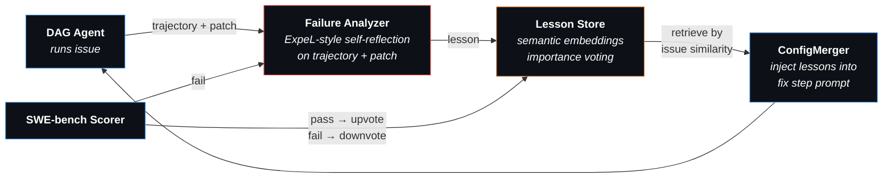

# Midas Agent

A self-improving coding agent that learns from its own failures. Given a set of GitHub issues, Midas trains a multi-step DAG workflow and builds a lesson library — so the agent avoids past mistakes on future issues.

## Motivation

Most coding agents use a fixed prompt and hope for the best. When they fail, the failure is discarded. Midas closes that loop:

1. The agent solves issues using a **generated multi-step DAG** (e.g., localize → investigate → fix → validate)
2. Failed attempts are **analyzed** — an LLM reflects on the agent's trajectory and patch to extract lessons (ExpeL-style)
3. Concrete lessons are **stored** in a lesson library with semantic embeddings
4. On new issues, **relevant lessons are retrieved** by similarity and injected into the fix step
5. Lessons that help get **upvoted**; lessons that don't get **downvoted** and eventually pruned

Over episodes, the lesson library accumulates battle-tested guidance like *"when fixing an error message, change the format string not the condition logic"*, *"don't just add a deprecation warning — actually change the behavior"*, *"never discard the original exception message."*

## Pipeline

### 1. Training Loop (per issue)

```
Issue → ConfigMerger → DAG Executor → Patch → SWE-bench Scorer → Record
               │              │
        embed issue     step 1 → step 2 → ... → step N
        + inject lessons   (StepJudge validates each transition)
```

For each SWE-bench issue, `ConfigMerger` embeds the issue into the DAG step prompts and injects relevant lessons from past failures. The agent executes each step in sequence — when it stops calling tools and produces text, `StepJudge` validates the claim and advances to the next step.

### 2. Learning from Failures



When an agent fails, the **Failure Analyzer** reflects on the agent's own trajectory (Thought → Action → Observation trace) and final patch — no gold test output is used (following ExpeL's principle of learning from the agent's own experience, not from evaluation feedback). Each lesson is stored alongside the original issue description. At inference time, the current issue description is embedded and compared against stored issue descriptions — when a similar issue is found (cosine similarity ≥ 0.50), the corresponding lesson (mistake + guidance) is injected into the fix step prompt.

**Importance voting** ensures the library self-corrects: lessons that help the agent pass get upvoted, lessons that don't help get downvoted and eventually pruned (at importance <= -4).

### Inspiration

- [**ExpeL**](https://arxiv.org/abs/2308.10144) (AAAI 2024) — experiential learning with lesson library and importance voting. Midas adapts ExpeL's dual-mode learning (specific trajectories + extracted insights) to coding agents on SWE-bench.
- [**GEPA**](https://arxiv.org/abs/2506.08056) (ICLR 2026) — Guided Evolutionary Prompt Adaptation from [DSPy](https://dspy.ai/). Midas explored GEPA-style prompt reflection before discovering that storing specific lessons outperforms generalizing them into prompt rewrites.

## Quick Start

```bash
poetry install
```

Configure your LLM provider in `.midas/config.yaml` (any [LiteLLM-compatible](https://docs.litellm.ai/docs/providers) model):

```yaml
model: your-provider/your-model
api_key: sk-...
api_base: https://...   # optional, depends on provider
```

### Train

```bash
# Train on all 500 SWE-bench Verified issues
midas train --config train_config_evolution.yaml

# Train on first N issues (for testing)
midas train --config train_config_evolution.yaml --issues 10

# Resume from checkpoint after interruption
midas train --resume .midas/train/<run-dir>/
```

### Infer

```bash
# Evaluate with trained DAG + lessons on all SWE-bench Verified issues
midas infer --dag .midas/train/<run>/log/configs/ws-0_latest.yaml \
            --lessons .midas/train/<run>/data/lessons.json

# Evaluate on first N issues
midas infer --dag config.yaml --lessons lessons.json --issues 50

# Without lessons (DAG only)
midas infer --dag config.yaml --issues 50

# Interactive mode
midas infer --dag config.yaml
```

## Key Features

- **Lesson library** — stores concrete failure analyses, retrieves by semantic similarity (sentence-transformers)
- **Importance voting** — upvote lessons that help, downvote ones that don't, prune at <= -4
- **DAG workflows** — multi-step plans generated from first successful trace
- **Failure analyzer** — ExpeL-style self-reflection on trajectory + patch (no gold test output)
- **ConfigMerger** — embeds issue + lessons into step prompts programmatically
- **No task_done tool** — text response = done; unknown tool calls treated as termination
- **Checkpoint & resume** — per-episode snapshots, lessons persist across runs

## Tests

> Work in progress — only 20 of 500 SWE-bench Verified issues tested so far.

Training run on 20 SWE-bench Verified issues (astropy subset) with MiniMax-M2.5. DAG generated from first successful episode (5 steps: localize → reproduce → implement → validate_targeted → validate_broad). Lessons extracted with `correct_approach` field.

**Solve rate: 12/20 (60%)**

### Training Episode Results

| Ep | Issue | Solved | Iters | Tokens | Lesson Injected | Lesson Impact |
|----|-------|--------|-------|--------|-----------------|---------------|
| 1 | [12907](https://github.com/astropy/astropy/issues/12907) | **Yes** | 20 | 186K | none (first episode) | — |
| 2 | [13033](https://github.com/astropy/astropy/issues/13033) | No | 42 | 591K | none available | Lesson created |
| 3 | [13236](https://github.com/astropy/astropy/issues/13236) | No | 94 | 1.2M | blocked (sim=0.42) | Lesson created |
| 4 | [13398](https://github.com/astropy/astropy/issues/13398) | No | 78 | 1.5M | blocked (sim=0.37) | Lesson created |
| 5 | [13453](https://github.com/astropy/astropy/issues/13453) | **Yes** | 48 | 910K | 13236 (sim=0.54) | Upvoted |
| 6 | [13579](https://github.com/astropy/astropy/issues/13579) | **Yes** | 65 | 1.4M | blocked (sim=0.40) | — |
| 7 | [13977](https://github.com/astropy/astropy/issues/13977) | No | 89 | 1.5M | blocked (sim=0.31) | Lesson created |
| 8 | [14096](https://github.com/astropy/astropy/issues/14096) | **Yes** | 69 | 1.5M | blocked (sim=0.32) | — |
| 9 | [14182](https://github.com/astropy/astropy/issues/14182) | No | 59 | 1.1M | 13236 (sim=0.53) | Downvoted |
| 10 | [14309](https://github.com/astropy/astropy/issues/14309) | **Yes** | 28 | 371K | 13236 (sim=0.54) | Upvoted |
| 11 | [14365](https://github.com/astropy/astropy/issues/14365) | No | 31 | 395K | blocked (sim=0.44) | Lesson created |
| 12 | [14369](https://github.com/astropy/astropy/issues/14369) | **Yes** | 78 | 1.5M | blocked (sim=0.45) | — |
| 13 | [14508](https://github.com/astropy/astropy/issues/14508) | **Yes** | 64 | 1.1M | blocked (sim=0.49) | — |
| 14 | [14539](https://github.com/astropy/astropy/issues/14539) | **Yes** | 43 | 924K | blocked (sim=0.43) | — |
| 15 | [14598](https://github.com/astropy/astropy/issues/14598) | No | 93 | 1.5M | blocked (sim=0.36) | Lesson created |
| 16 | [14995](https://github.com/astropy/astropy/issues/14995) | **Yes** | 43 | 691K | blocked (sim=0.42) | — |
| 17 | [7166](https://github.com/astropy/astropy/issues/7166) | **Yes** | 44 | 478K | blocked (sim=0.14) | — |
| 18 | [7336](https://github.com/astropy/astropy/issues/7336) | **Yes** | 13 | 71K | 13977 (sim=0.53) | Upvoted |
| 19 | [7606](https://github.com/astropy/astropy/issues/7606) | No | 31 | 217K | 13977 (sim=0.62) | Downvoted |
| 20 | [7671](https://github.com/astropy/astropy/issues/7671) | **Yes** | 50 | 668K | 7606 (sim=0.53) | Upvoted |

#### Lesson Analysis

Each lesson contains three fields: **mistake** (what went wrong), **lesson** (abstract rule), and **correct_approach** (what to do instead). Below is a per-injection analysis of whether the lesson content was actually relevant to the target issue.

**Episode 5** — 13236 lesson → 13453 (sim=0.54) — **Solved, Upvoted**

The 13236 lesson says: *"deprecation warnings must not break existing tests; distinguish user-initiated vs internal code paths."* Issue 13453 is about the HTML table writer ignoring user-supplied `formats` — an unrelated problem (column formatting, not warnings). Both issues involve `astropy.table`, which explains the embedding similarity, but the lesson content has no bearing on the fix. The agent solved this on its own. The upvote is a false positive — the lesson was present but did not contribute.

**Episode 9** — 13236 lesson → 14182 (sim=0.53) — **Failed, Downvoted**

Issue 14182 asks for `header_rows` support in the RST table writer. The 13236 lesson about deprecation warnings is irrelevant — the fix requires adding header row rendering to a writer class, not handling warnings. Correct downvote.

**Episode 10** — 13236 lesson → 14309 (sim=0.54) — **Solved, Upvoted**

Issue 14309 is an `IndexError` in `is_fits` when `args` is empty. The 13236 lesson about warnings is irrelevant — the fix is a simple guard (`if args` before `args[0]`). The agent solved this independently. Another false-positive upvote.

**Episode 18** — 13977 lesson → 7336 (sim=0.53) — **Solved, Upvoted**

The 13977 lesson says: *"only return NotImplemented for type incompatibility, not semantic errors."* Its correct_approach: *"distinguish type incompatibility (return NotImplemented) from unit incompatibility (propagate)."* Issue 7336 is about `@quantity_input` failing when the return annotation is `None` — the decorator tries to call `.to()` on `None`. Both issues involve the Quantity/unit system and require explicit None/type checks before attempting conversion. The lesson's guidance about explicit type checking before conversion is directly applicable. **This is the strongest case of a lesson actually helping** — the correct_approach's emphasis on checking types before conversion maps to the fix (check if return annotation is None before calling `.to()`).

**Episode 19** — 13977 lesson → 7606 (sim=0.62) — **Failed, Downvoted**

Issue 7606 is about `Unit.__eq__(None)` raising `TypeError`. The 13977 lesson about type-vs-semantic incompatibility is directly relevant — the fix is to check `if other is None: return False` before conversion. But the agent still applied an overly broad exception handler (catching all ValueError, UnitsError, TypeError), which is exactly the anti-pattern the lesson warned against. **The lesson was relevant but the agent ignored it.** The correct_approach said *"check if the input is a duck type and return NotImplemented only for type incompatibility"* — the agent should have added a None check, but instead wrapped everything in a broad try/except. This suggests the agent reads the lesson but doesn't internalize the constraint when the code is complex enough.

**Episode 20** — 7606 lesson → 7671 (sim=0.53) — **Solved, Upvoted**

The 7606 lesson says: *"when fixing equality comparison with None, explicitly check for None before conversion."* Issue 7671 is about `LooseVersion` comparison failing with mixed int/string components — a version parsing problem, not an equality-with-None problem. The lesson is irrelevant despite the similarity score. The agent solved this independently. False-positive upvote.

#### Observations

**Lesson retrieval is noisy.** 6 lessons were injected across 20 episodes. Of these, 1 was directly relevant and likely helped (ep18: 13977→7336), 1 was relevant but the agent ignored it (ep19: 13977→7606), and 4 were irrelevant false matches from embedding similarity (both issues being in the same astropy submodule).

**Most solves happen without lessons.** 9 of the 12 solved episodes had no lesson injected. The DAG workflow (localize → reproduce → implement → validate) carries most of the value.

**Importance voting has false positives.** When a lesson is injected and the agent solves the issue independently, the lesson gets upvoted despite not contributing. This inflates importance scores for irrelevant lessons. A more precise voting signal (e.g., comparing solve rate with and without the lesson) would help.

**The similarity threshold (0.50) works well.** It blocked injection in 14 of 20 episodes where the top match was irrelevant. Without it, every episode would have received an irrelevant lesson from a different astropy submodule.

**`correct_approach` quality is high.** The extracted correct_approach fields contain specific, actionable strategies (e.g., "check for None before conversion", "normalize captured strings to uppercase after regex matching"). Whether the agent acts on them is a separate question.

#### Trained Artifacts

The DAG config and lesson library from this run are stored in `artifacts/`:

```
artifacts/
├── dag.yaml           # 5-step DAG workflow
└── lessons.json       # 8 lessons with correct_approach
```

## Training Output

```
.midas/train/<run>/
├── checkpoint.json
├── train_config.yaml
├── all_preds.jsonl              # SWE-bench submission
├── data/
│   ├── lessons.json             # Lesson library with embeddings
│   ├── ep1_<issue_id>.json      # Success traces
│   └── fail2_<issue_id>.json    # Failure traces
└── log/configs/                 # DAG YAML per episode
```
