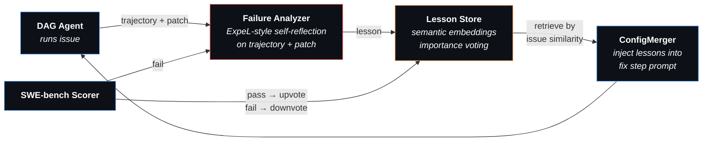

# Midas Agent

A self-improving coding agent that learns from its own failures. Given a set of GitHub issues, Midas trains a multi-step DAG workflow and builds a lesson library — so the agent avoids past mistakes on future issues.

## Motivation

Most coding agents use a fixed prompt and hope for the best. When they fail, the failure is discarded. Midas closes that loop:

1. The agent solves issues using a **generated multi-step DAG** (e.g., localize → investigate → fix → validate)
2. Failed attempts are **analyzed** — an LLM reflects on the agent's trajectory and patch to extract lessons (ExpeL-style)
3. Concrete lessons are **stored** in a lesson library with semantic embeddings
4. On new issues, **relevant lessons are retrieved** by similarity and injected into the fix step
5. Lessons that help get **upvoted**; lessons that don't get **downvoted** and eventually pruned

Over episodes, the lesson library accumulates battle-tested guidance like *"when fixing an error message, change the format string not the condition logic"*, *"don't just add a deprecation warning — actually change the behavior"*, *"never discard the original exception message."*

## Pipeline

### 1. Training Loop (per issue)

```
Issue → ConfigMerger → DAG Executor → Patch → SWE-bench Scorer → Record
               │              │
        embed issue     step 1 → step 2 → ... → step N
        + inject lessons   (StepJudge validates each transition)
```

For each SWE-bench issue, `ConfigMerger` embeds the issue into the DAG step prompts and injects relevant lessons from past failures. The agent executes each step in sequence — when it stops calling tools and produces text, `StepJudge` validates the claim and advances to the next step.

### 2. Learning from Failures



When an agent fails, the **Failure Analyzer** reflects on the agent's own trajectory (Thought → Action → Observation trace) and final patch — no gold test output is used (following ExpeL's principle of learning from the agent's own experience, not from evaluation feedback). Each lesson is stored alongside the original issue description. At inference time, the current issue description is embedded and compared against stored issue descriptions — when a similar issue is found (cosine similarity ≥ 0.50), the corresponding lesson (mistake + guidance) is injected into the fix step prompt.

**Importance voting** ensures the library self-corrects: lessons that help the agent pass get upvoted, lessons that don't help get downvoted and eventually pruned (at importance <= -4).

### Inspiration

- [**ExpeL**](https://arxiv.org/abs/2308.10144) (AAAI 2024) — experiential learning with lesson library and importance voting. Midas adapts ExpeL's dual-mode learning (specific trajectories + extracted insights) to coding agents on SWE-bench.
- [**GEPA**](https://arxiv.org/abs/2506.08056) (ICLR 2026) — Guided Evolutionary Prompt Adaptation from [DSPy](https://dspy.ai/). Midas explored GEPA-style prompt reflection before discovering that storing specific lessons outperforms generalizing them into prompt rewrites.

## Quick Start

```bash
poetry install
```

Configure your LLM provider in `.midas/config.yaml` (any [LiteLLM-compatible](https://docs.litellm.ai/docs/providers) model):

```yaml
model: your-provider/your-model
api_key: sk-...
api_base: https://...   # optional, depends on provider
```

### Train

```bash
# Train on all 500 SWE-bench Verified issues
midas train --config train_config_evolution.yaml

# Train on first N issues (for testing)
midas train --config train_config_evolution.yaml --issues 10

# Resume from checkpoint after interruption
midas train --resume .midas/train/<run-dir>/
```

### Infer

```bash
# Evaluate with trained DAG + lessons on all SWE-bench Verified issues
midas infer --dag .midas/train/<run>/log/configs/ws-0_latest.yaml \
            --lessons .midas/train/<run>/data/lessons.json

# Evaluate on first N issues
midas infer --dag config.yaml --lessons lessons.json --issues 50

# Without lessons (DAG only)
midas infer --dag config.yaml --issues 50

# Interactive mode
midas infer --dag config.yaml
```

## Key Features

- **Lesson library** — stores concrete failure analyses, retrieves by semantic similarity (sentence-transformers)
- **Importance voting** — upvote lessons that help, downvote ones that don't, prune at <= -4
- **DAG workflows** — multi-step plans generated from first successful trace
- **Failure analyzer** — ExpeL-style self-reflection on trajectory + patch (no gold test output)
- **ConfigMerger** — embeds issue + lessons into step prompts programmatically
- **No task_done tool** — text response = done; unknown tool calls treated as termination
- **Checkpoint & resume** — per-episode snapshots, lessons persist across runs

## Tests

> Work in progress.

## Training Output

```
.midas/train/<run>/
├── checkpoint.json
├── train_config.yaml
├── all_preds.jsonl              # SWE-bench submission
├── data/
│   ├── lessons.json             # Lesson library with embeddings
│   ├── ep1_<issue_id>.json      # Success traces
│   └── fail2_<issue_id>.json    # Failure traces
└── log/configs/                 # DAG YAML per episode
```
