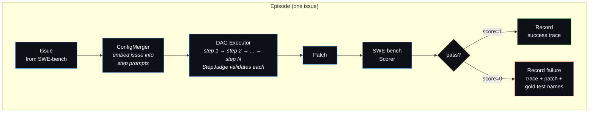
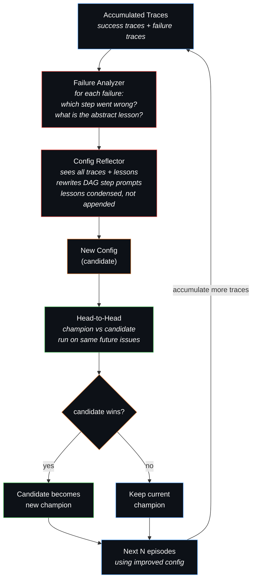

# Midas Agent

A self-improving coding agent that learns from its own failures. Given a set of GitHub issues, Midas trains a multi-step DAG workflow through a closed-loop process: solve issues, analyze failures, reflect on what went wrong, and evolve the workflow prompts — so the next batch of issues benefits from past mistakes.

## Motivation

Most coding agents use a fixed prompt and hope for the best. When they fail, the failure is discarded. Midas closes that loop:

1. The agent solves issues using a **multi-step DAG** (localize → investigate → fix → validate)
2. Failed attempts are **analyzed** — an LLM identifies which step went wrong and extracts an abstract lesson
3. A **reflector** rewrites the DAG prompts to incorporate those lessons
4. The new config is **validated head-to-head** against the old one on fresh issues
5. The winner survives. Repeat.

Over episodes, the DAG prompts evolve from generic instructions into battle-tested guidance like *"don't edit test files"*, *"fix the error message, not the condition logic"*, *"actually change the behavior, don't just add a deprecation warning."*

## Pipeline

### 1. Training Loop (per issue)

Each episode takes one SWE-bench issue and runs it through the current DAG config:



### 2. Config Evolution (every N episodes)

After N episodes, the accumulated traces trigger the evolution cycle — this is the **closed loop**:



The first diagram runs hundreds of times. The second diagram triggers periodically and feeds an improved config back into the first — forming the closed loop.

## Quick Start

```bash
poetry install

# Configure LLM (any LiteLLM-compatible provider)
cat > .midas/config.yaml << EOF
model: minimax/MiniMax-M2.5
api_key: sk-...
api_base: https://api.minimax.io/v1
EOF

# Train (evolves DAG config over episodes)
midas train --config train_config_evolution.yaml --issues 30

# Resume from checkpoint
midas train --resume .midas/train/my-run/

# Eval with frozen config (no evolution)
midas infer --dag .midas/train/my-run/log/configs/ws-0_ep10.yaml --issues 50

# Interactive mode
midas infer --dag config.yaml
```

## Key Features

- **Closed-loop learning** — failures are analyzed, lessons extracted, prompts improved
- **DAG workflows** — multi-step plans that evolve from generic to battle-tested
- **Adaptive workspaces** — champion vs challenger, winner survives
- **No task_done tool** — text response = done; unknown tool calls treated as termination
- **ConfigMerger** — embeds issue into step prompts to prevent overscoping
- **Rich failure analysis** — sees full trace, patch diff, and gold test names
- **Checkpoint & resume** — per-episode snapshots, crash-safe

## Training Output

```
.midas/train/<run>/
├── checkpoint.json
├── train_config.yaml
├── all_preds.jsonl          # SWE-bench submission
├── data/                    # Success + failure traces (GEPA dataset)
└── log/configs/             # DAG YAML per episode (shows prompt evolution)
```
