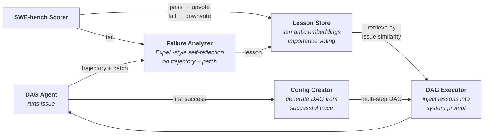

# Midas Agent

> **Status: Early concept validation** — this project is in the exploratory research phase. APIs, architecture, and results may change significantly.

A self-improving coding agent that learns from its own failures. Given a set of GitHub issues, Midas trains a multi-step DAG workflow and builds a lesson library — so the agent avoids past mistakes on future issues.

## Motivation

Most coding agents use a fixed prompt and hope for the best. When they fail, the failure is discarded. Midas closes that loop:

1. The agent solves issues using a **generated multi-step DAG** (e.g., localize → investigate → fix → validate)
2. Failed attempts are **analyzed** — an LLM reflects on the agent's trajectory and patch to extract lessons (ExpeL-style)
3. Concrete lessons are **stored** in a lesson library with semantic embeddings
4. On new issues, **relevant lessons are retrieved** by similarity and injected into the fix step
5. Lessons that help get **upvoted**; lessons that don't get **downvoted** and eventually pruned

Over episodes, the lesson library accumulates battle-tested guidance like *"when fixing an error message, change the format string not the condition logic"*, *"don't just add a deprecation warning — actually change the behavior"*, *"never discard the original exception message."*

## Pipeline

### 1. Training Loop (per issue)

```
Issue → ConfigMerger → DAG Executor → Patch → SWE-bench Scorer → Record
               │              │
        embed issue     retrieve lessons + inject into system prompt
        into steps      step 1 → step 2 → ... → step N
                          (StepJudge validates each transition)
```

For each SWE-bench issue, `ConfigMerger` embeds the issue description into the DAG step prompts. The `DAG Executor` retrieves relevant lessons from the lesson store and injects them into the system prompt, then executes each step in sequence — when the agent stops calling tools and produces text, `StepJudge` validates the claim and advances to the next step.

### 2. Learning from Failures



When an agent fails, the **Failure Analyzer** reflects on the agent's own trajectory (Thought → Action → Observation trace) and final patch — no gold test output is used (following ExpeL's principle of learning from the agent's own experience, not from evaluation feedback). Each lesson is stored alongside the original issue description. At inference time, the current issue description is embedded and compared against stored issue descriptions — when a similar issue is found (cosine similarity ≥ 0.50), the corresponding lesson (mistake + guidance) is injected into the **system prompt** (available to all DAG steps, not just a single step).

On the first successful episode, the **Config Creator** generates a multi-step DAG workflow from the agent's action history, replacing the default single-step config with a structured plan (e.g., localize → reproduce → implement → validate).

**Importance voting** ensures the library self-corrects: lessons that help the agent pass get upvoted, lessons that don't help get downvoted and eventually pruned (at importance <= -10).

### Inspiration

- [**ExpeL**](https://arxiv.org/abs/2308.10144) (AAAI 2024) — experiential learning with lesson library and importance voting. Midas adapts ExpeL's dual-mode learning (specific trajectories + extracted insights) to coding agents on SWE-bench.
- [**GEPA**](https://arxiv.org/abs/2506.08056) (ICLR 2026) — Guided Evolutionary Prompt Adaptation from [DSPy](https://dspy.ai/). Midas explored GEPA-style prompt reflection before discovering that storing specific lessons outperforms generalizing them into prompt rewrites.

## Quick Start

```bash
poetry install
```

Configure your LLM provider in `.midas/config.yaml` (any [LiteLLM-compatible](https://docs.litellm.ai/docs/providers) model):

```yaml
model: your-provider/your-model
api_key: sk-...
api_base: https://...   # optional, depends on provider
```

### Train

```bash
# Train on all 500 SWE-bench Verified issues
midas train --config train_config_evolution.yaml

# Train on first N issues (for testing)
midas train --config train_config_evolution.yaml --issues 10

# Resume from checkpoint after interruption
midas train --resume .midas/train/<run-dir>/
```

### Infer

```bash
# Evaluate with trained DAG + lessons on all SWE-bench Verified issues
midas infer --dag .midas/train/<run>/log/configs/ws-0_latest.yaml \
            --lessons .midas/train/<run>/data/lessons.json

# Evaluate on first N issues
midas infer --dag config.yaml --lessons lessons.json --issues 50

# Without lessons (DAG only)
midas infer --dag config.yaml --issues 50

# Interactive mode
midas infer --dag config.yaml
```

## Key Features

- **Lesson library** — stores concrete failure analyses, retrieves by semantic similarity (sentence-transformers)
- **Importance voting** — upvote lessons that help, downvote ones that don't, prune at <= -10
- **DAG workflows** — multi-step plans generated from first successful trace
- **Failure analyzer** — ExpeL-style self-reflection on trajectory + patch (no gold test output)
- **ConfigMerger** — embeds issue context into step prompts programmatically
- **Config Creator** — generates multi-step DAG from first successful trace
- **No task_done tool** — text response = done; unknown tool calls treated as termination
- **Checkpoint & resume** — per-episode snapshots, lessons persist across runs

## Evaluation

> Work in progress — only 20 of 500 SWE-bench Verified issues tested so far.

### Head-to-Head: Midas Agent vs SWE-agent v1.1.0

Same model (MiniMax-M2.5), same 20 SWE-bench Verified issues (astropy subset). Midas Agent uses its trained 5-step DAG with a 1.5M token budget per issue. SWE-agent v1.1.0 uses its default config (function calling, anthropic-style file map, review-on-submit) with a 100-call limit per issue.

| Issue | Midas | SWE-agent | Midas Iters | Midas Tokens | SWE-agent Iters | SWE-agent Tokens |
|-------|-------|-----------|-------------|--------------|-----------------|------------------|
| [12907](https://github.com/astropy/astropy/issues/12907) | **PASS** | **PASS** | 20 | 186K | 48 | 805K |
| [13033](https://github.com/astropy/astropy/issues/13033) | FAIL | FAIL | 42 | 591K | 61 | 1,248K |
| [13236](https://github.com/astropy/astropy/issues/13236) | FAIL | FAIL | 94 | 1,200K | 90 | 2,049K |
| [13398](https://github.com/astropy/astropy/issues/13398) | FAIL | FAIL | 78 | 1,500K | 73 | 3,199K |
| [13453](https://github.com/astropy/astropy/issues/13453) | **PASS** | **PASS** | 48 | 910K | 54 | 869K |
| [13579](https://github.com/astropy/astropy/issues/13579) | **PASS** | **PASS** | 65 | 1,400K | 57 | 2,169K |
| [13977](https://github.com/astropy/astropy/issues/13977) | FAIL | FAIL | 89 | 1,500K | 78 | 1,956K |
| [14096](https://github.com/astropy/astropy/issues/14096) | **PASS** | **PASS** | 69 | 1,500K | 38 | 677K |
| [14182](https://github.com/astropy/astropy/issues/14182) | FAIL | FAIL | 59 | 1,100K | 45 | 505K |
| [14309](https://github.com/astropy/astropy/issues/14309) | **PASS** | **PASS** | 28 | 371K | 59 | 855K |
| [14365](https://github.com/astropy/astropy/issues/14365) | FAIL | FAIL | 31 | 395K | 39 | 611K |
| [14369](https://github.com/astropy/astropy/issues/14369) | **PASS** | FAIL | 78 | 1,500K | 61 | 1,496K |
| [14508](https://github.com/astropy/astropy/issues/14508) | **PASS** | **PASS** | 64 | 1,100K | 66 | 1,576K |
| [14539](https://github.com/astropy/astropy/issues/14539) | **PASS** | **PASS** | 43 | 924K | 44 | 658K |
| [14598](https://github.com/astropy/astropy/issues/14598) | FAIL | FAIL | 93 | 1,500K | 81 | 1,798K |
| [14995](https://github.com/astropy/astropy/issues/14995) | **PASS** | **PASS** | 43 | 691K | 42 | 517K |
| [7166](https://github.com/astropy/astropy/issues/7166) | **PASS** | **PASS** | 44 | 478K | 40 | 566K |
| [7336](https://github.com/astropy/astropy/issues/7336) | **PASS** | **PASS** | 13 | 71K | 27 | 209K |
| [7606](https://github.com/astropy/astropy/issues/7606) | FAIL | FAIL | 31 | 217K | 31 | 245K |
| [7671](https://github.com/astropy/astropy/issues/7671) | **PASS** | **PASS** | 50 | 668K | 32 | 305K |

### Summary

| Metric | Midas Agent | SWE-agent v1.1.0 |
|--------|-------------|-------------------|
| **Pass rate** | **12/20 (60%)** | 11/20 (55%) |
| **Avg iterations/issue** | **47** | 53 |
| **Avg tokens/issue** | **843K** | 1,115K |
| **Total tokens (20 issues)** | **16.9M** | 22.3M |
| **Unique solves** | 1 (14369) | 0 |

Both agents share 11 common solves. Midas uniquely solves 14369, while every issue SWE-agent solves is also solved by Midas. Midas uses 25% fewer tokens on average due to its structured DAG workflow — the multi-step plan (localize, reproduce, implement, validate) avoids the aimless exploration that consumes tokens in a single-prompt agent.

### Remarks

- **Lesson retrieval does not necessarily improve results.** In the 20-issue training run, only 1 of 6 injected lessons clearly helped the agent (ep18: "check types before conversion" guided a None-check fix). Most solves (9/12) happened without any lesson. The similarity threshold (0.50) correctly blocked injection in 14/20 episodes, but importance voting suffers from false-positive upvotes when an irrelevant lesson is present during an independent solve. Self-retrieval of lessons on the same issue set is not meaningful — lessons need to be tested on *unseen* issues to measure real generalization.
- **The DAG structure is the primary contributor to performance**, not lesson retrieval. The 5-step workflow (localize → reproduce → implement → validate_targeted → validate_broad) enforces a disciplined approach that prevents the agent from burning tokens on unfocused exploration.
- **Further tests are being planned.** We intend to evaluate on the full 500-issue SWE-bench Verified set, test lesson transfer across different repositories (not just astropy), and compare with additional baselines and models.

### Training Episode Details

Training run on 20 SWE-bench Verified issues (astropy subset) with MiniMax-M2.5. DAG generated from first successful episode (5 steps: localize → reproduce → implement → validate_targeted → validate_broad). Lessons extracted with `correct_approach` field.

| Ep | Issue | Solved | Iters | Tokens | Lesson Injected | Lesson Impact |
|----|-------|--------|-------|--------|-----------------|---------------|
| 1 | [12907](https://github.com/astropy/astropy/issues/12907) | **Yes** | 20 | 186K | none (first episode) | — |
| 2 | [13033](https://github.com/astropy/astropy/issues/13033) | No | 42 | 591K | none available | Lesson created |
| 3 | [13236](https://github.com/astropy/astropy/issues/13236) | No | 94 | 1.2M | blocked (sim=0.42) | Lesson created |
| 4 | [13398](https://github.com/astropy/astropy/issues/13398) | No | 78 | 1.5M | blocked (sim=0.37) | Lesson created |
| 5 | [13453](https://github.com/astropy/astropy/issues/13453) | **Yes** | 48 | 910K | 13236 (sim=0.54) | Upvoted |
| 6 | [13579](https://github.com/astropy/astropy/issues/13579) | **Yes** | 65 | 1.4M | blocked (sim=0.40) | — |
| 7 | [13977](https://github.com/astropy/astropy/issues/13977) | No | 89 | 1.5M | blocked (sim=0.31) | Lesson created |
| 8 | [14096](https://github.com/astropy/astropy/issues/14096) | **Yes** | 69 | 1.5M | blocked (sim=0.32) | — |
| 9 | [14182](https://github.com/astropy/astropy/issues/14182) | No | 59 | 1.1M | 13236 (sim=0.53) | Downvoted |
| 10 | [14309](https://github.com/astropy/astropy/issues/14309) | **Yes** | 28 | 371K | 13236 (sim=0.54) | Upvoted |
| 11 | [14365](https://github.com/astropy/astropy/issues/14365) | No | 31 | 395K | blocked (sim=0.44) | Lesson created |
| 12 | [14369](https://github.com/astropy/astropy/issues/14369) | **Yes** | 78 | 1.5M | blocked (sim=0.45) | — |
| 13 | [14508](https://github.com/astropy/astropy/issues/14508) | **Yes** | 64 | 1.1M | blocked (sim=0.49) | — |
| 14 | [14539](https://github.com/astropy/astropy/issues/14539) | **Yes** | 43 | 924K | blocked (sim=0.43) | — |
| 15 | [14598](https://github.com/astropy/astropy/issues/14598) | No | 93 | 1.5M | blocked (sim=0.36) | Lesson created |
| 16 | [14995](https://github.com/astropy/astropy/issues/14995) | **Yes** | 43 | 691K | blocked (sim=0.42) | — |
| 17 | [7166](https://github.com/astropy/astropy/issues/7166) | **Yes** | 44 | 478K | blocked (sim=0.14) | — |
| 18 | [7336](https://github.com/astropy/astropy/issues/7336) | **Yes** | 13 | 71K | 13977 (sim=0.53) | Upvoted |
| 19 | [7606](https://github.com/astropy/astropy/issues/7606) | No | 31 | 217K | 13977 (sim=0.62) | Downvoted |
| 20 | [7671](https://github.com/astropy/astropy/issues/7671) | **Yes** | 50 | 668K | 7606 (sim=0.53) | Upvoted |

### Trained Artifacts

The DAG config and lesson library from this run are stored in `artifacts/`:

```
artifacts/
├── dag.yaml           # 5-step DAG workflow
└── lessons.json       # 8 lessons with correct_approach
```

## Training Output

```
.midas/train/<run>/
├── checkpoint.json
├── train_config.yaml
├── all_preds.jsonl              # SWE-bench submission
├── data/
│   ├── lessons.json             # Lesson library with embeddings
│   ├── ep1_<issue_id>.json      # Success traces
│   └── fail2_<issue_id>.json    # Failure traces
└── log/configs/                 # DAG YAML per episode
```
